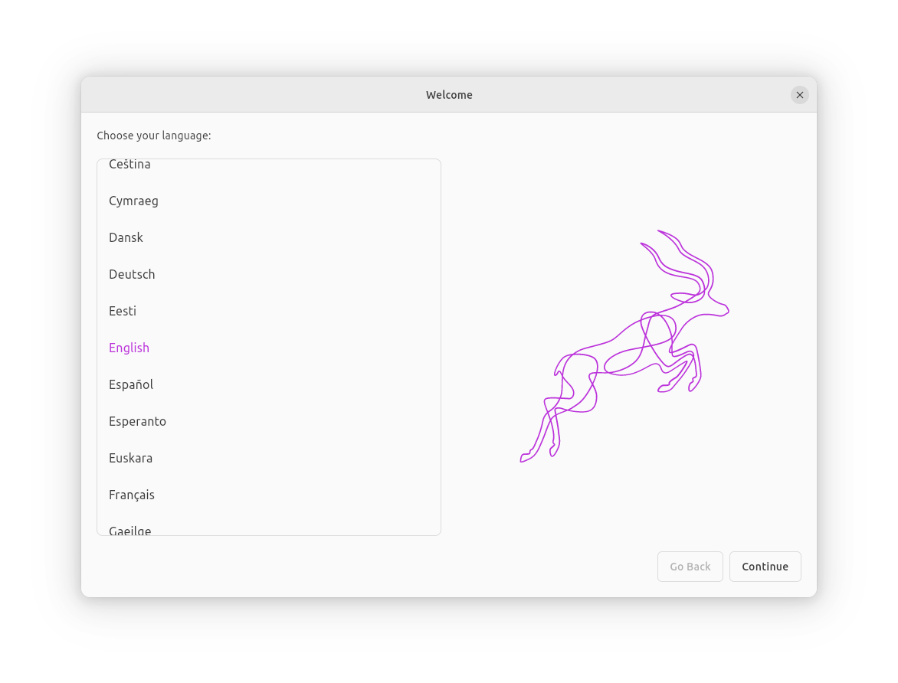
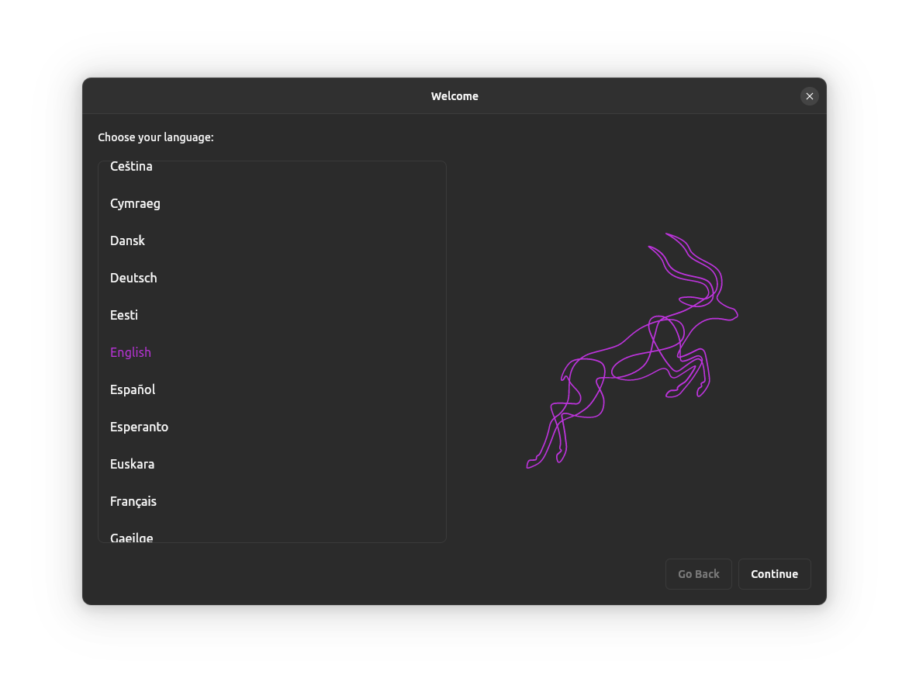

# Ubuntu Flavor Installer

[Ubuntu Desktop Installer](https://github.com/canonical/ubuntu-desktop-installer)
starting point for Ubuntu flavors.

| Light | Dark |
|---|---|
|  |  |

## Getting started

1. Init submodules:
    ```sh
    git submodule update --init --recursive
    ```

2. Install curtin and probert:
    ```sh
    make -C packages/subiquity_client/subiquity gitdeps
    ```

3. Install subiquity dependencies:
    ```sh
    sudo packages/subiquity_client/subiquity/scripts/installdeps.sh
    ```

3. [Install Flutter](https://docs.flutter.dev/get-started/install/linux)

4. Run the installer:
    ```
    flutter pub get
    flutter run -d linux
    ```
