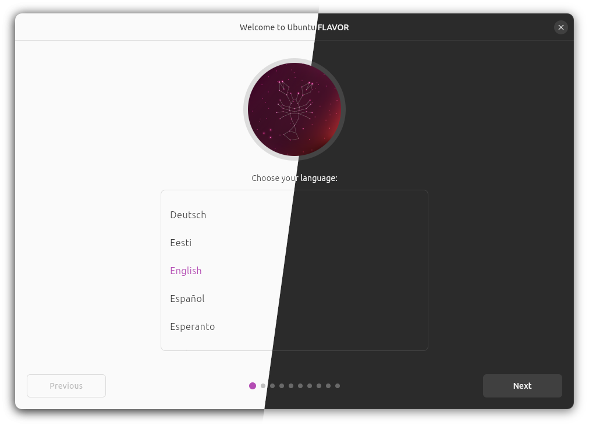

# Ubuntu Flavor Installer

[Ubuntu Desktop Installer](https://github.com/canonical/ubuntu-desktop-installer)
starting point for Ubuntu flavors.



## Getting started

1. Init submodules:
    ```sh
    git submodule update --init --recursive
    ```

2. Install Subiquity's dependencies:
    ```sh
    make install_deps
    ```

3. [Install Flutter](https://docs.flutter.dev/get-started/install/linux)

4. Run the installer:
    ```
    flutter pub get
    flutter run -d linux
    ```

## Look and feel

The desktop installer has an entry point that allows passing in the name of the flavor displayed throughout the installation wizard, the desired flavor-specific theme, and the flavor’s own installation slides together with delegates for localization.

```dart
import 'package:ubuntu_bootstrap/ubuntu_bootstrap.dart';
import 'package:flutter_gen/gen_l10n/app_localizations.dart';
import 'package:yaru/yaru.dart';

import 'slides.dart';

Future<void> main(List<String> args) {
  return runInstallerApp(
    args,
    flavor: UbuntuFlavor.xxx,
    theme: yaruMagentaLight,
    darkTheme: yaruMagentaDark,
    localizationsDelegates: AppLocalizations.localizationsDelegates,
    slides: [
      buildFirstSlide,
      buildSecondSlide,
      buildThirdSlide,
    ],
  );
}
```

- `flavor`: [UbuntuFlavor](https://pub.dev/documentation/ubuntu_flavor/latest/ubuntu_flavor/UbuntuFlavor-class.html)
- `theme` and `darkTheme`: [ThemeData](https://api.flutter.dev/flutter/material/ThemeData-class.html)

## Image assets

Images such as logos and theme previews can be customized by overriding assets used in the desktop installer by creating assets by the same name in the flavor installer. Whenever the desktop installer shows images, it looks up the application (flavor) assets first and if not found, falls back to the one in `ubuntu_provision` or `ubuntu_bootstrap`. Therefore, a flavor can freely choose to override a subset or all images.

The full set of image assets is visible at:
- [ubuntu-desktop-provision/ubuntu_provision/assets](https://github.com/canonical/ubuntu-desktop-provision/tree/main/packages/ubuntu_provision/assets)
- [ubuntu-desktop-provision/ubuntu_bootstrap/assets](https://github.com/canonical/ubuntu-desktop-provision/tree/main/packages/ubuntu_bootstrap/assets)
